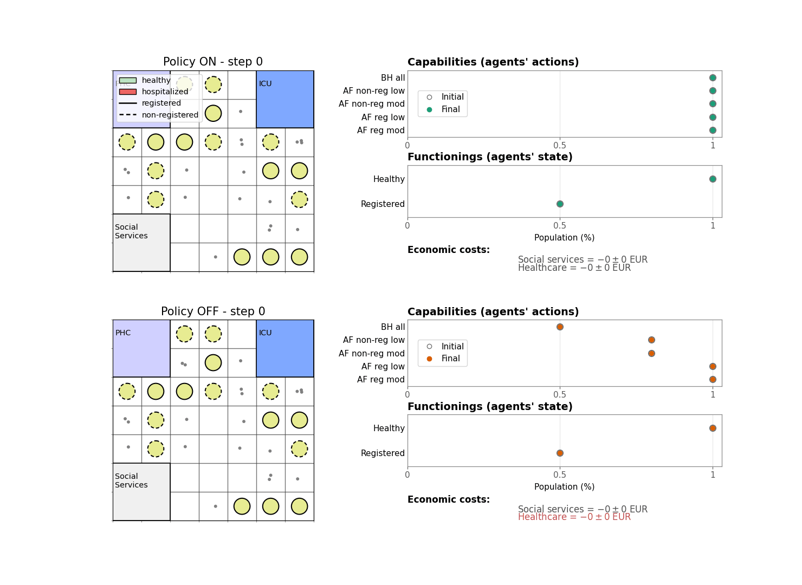
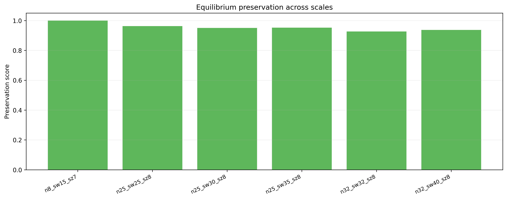
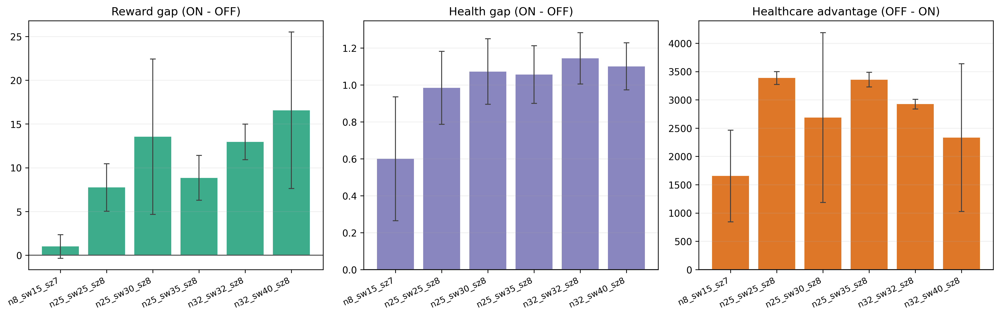
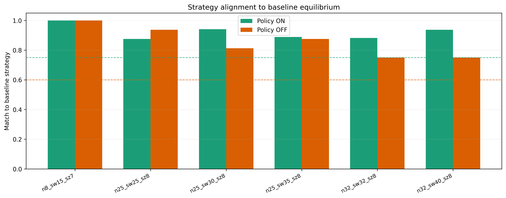

# Inclusive Healthcare Simulation

Imagine policy-makers could anticipate the impact of inclusive legal policies using a simulation tool.
Imagine they could explore how policies affect the most disadvantaged groups of people in specific contexts, such as people experiencing homelessness (PEH) in healthcare. 

This repository contains the first step towards this goal: an agent-based simulation framework for policy design in inequity contexts. We define a **multi-agent reinforcement learning** (MARL) environment where agents behave to restore their capabilities under the constraints of a given policy.

PEH agents learn strategies under two policy scenarios:

- `policy OFF`: medical attention is available only to registered PEH agents.
- `policy ON`: medical attention is available regardless of registration.

The simulation tracks optimal rewards, strategies, health and registration states, social-service engagement, government spending, and individual central capabilities such as Bodily Health and Affiliation. We track their opportunities (capabilities), and see how these are deprived, restored or even expanded at different instants of time.

Building upon [Aguilera et al. (2024)](https://arxiv.org/abs/2503.18389), *Agent-based Modeling meets the Capability Approach for Human Development: Simulating Homelessness Policy-making*. arXiv:2503.18389 [cs.AI], and [Aguilera et al. (2025)](https://arxiv.org/abs/2507.23644), *Agents trusting Agents? Restoring Lost Capabilities with Inclusive Healthcare*. arXiv:2507.23644 [cs.AI].

## Documentation

Start with the documentation index:

- [Docs README](docs/README.md)
- [Simulation Overview](docs/simulation.md)
- [Agent Behavior](docs/agents.md)
- [Learning Algorithm](docs/learning_algorithm.md)
- [Synthetic Data and Calibration](docs/synthetic_data_and_calibration.md)
- [Experiments and Outputs](docs/experiments_and_outputs.md)
- [Project Structure](docs/project_structure.md)

## Installation

From the repository root:

```bash
pip install -r requirements.txt
```

## Main Commands

Generate synthetic population data and calibration artifacts:

```bash
python -m learning.synthetic_data
```

Run the deterministic multi-seed PBRS/Q-learning experiment, the scalability analysis and generate paper-ready figures:

```bash
python -m learning.qpbrs_seeds --seeds 0 1 2 3 4
python -m learning.qpbrs_scalability
python -m learning.paper_figures
```

For a fast smoke test:

```bash
python -m learning.qpbrs_seeds --seeds 0 --episodes 5 --train-max-steps 20 --eval-max-steps 50
```

## Outputs

Runs write results under `output/`, usually in timestamped folders:

- `output/robustness_seeds/run_<timestamp>/`
- `output/scalability/run_<timestamp>/`
- `output/paper_ready/run_<timestamp>/`

## Example Visual Output

Figure 3 style policy evolution comparison for `N=16`, `N_sw=20`, `size=7`:



Selected paper figures:

- `N=16`: [Figure 3](output/paper_selected/n16/figure3_dumbbell.png)
- `N=25`: [Figure 3](output/paper_selected/n25/figure3_dumbbell.png)
- `N=16`: [Figure 2 OFF rewards](output/paper_selected/n16/figure2_policy_off_rewards.png)
- `N=16`: [Figure 2 OFF strategies](output/paper_selected/n16/figure2_policy_off_strategies.png)

Example scalability plots:







The latest selected scalability summary is stored in:

- `output/paper_selected/scalability/summary.md`
- `output/paper_selected/scalability/scalability_summary.csv`

## Research Context

This project builds on:

- Aguilera et al. (2024), *Agent-based Modeling meets the Capability Approach for Human Development: Simulating Homelessness Policy-making*, arXiv:2503.18389.
- Aguilera et al. (2025), *Agents Trusting Agents? Restoring Lost Capabilities with Inclusive Healthcare*, arXiv:2507.23644.

## Current Focus

The most reproducible experiment path is `learning.qpbrs_seeds`, with `learning.qpbrs_scalability` for scale analysis, `learning.paper_figures` for manuscript-style outputs, and `generate_gif.py` for the Figure 3 style evolution GIF. Earlier scripts such as `learning.qpbrs` and `learning.qlearningMAexplore` remain useful for exploration and historical context.
